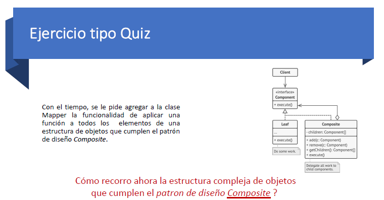

## Pregunta 3



```bash
# Se recorre a traves de la delegacion recursiva se implementa un metodo en la interfaz llamado
# recorrer():void
# En la clase Leaf imprime su valor
# En la clase Composite imprime su valor y manda a llamar al metodo recorrer en todos sus Componentes

#Ejemplo

class Leaf <T> implements Component<T>{
    constructor(public value: T){}
    aplicar(f: (e: T) => T):void {
        this.value=f(this.value)
    }
    recorrer(): void {
        console.log(`soy una hoja mi valor es: ${JSON.stringify(this.value)}`);
    }
}

class Composite <T> implements Component<T>{
    components:Component<T>[]=[]

    constructor(public value: T){}

    aplicar(f: (e: T) => T):void {
        this.value=f(this.value)
        this.components.forEach(c=>c.aplicar(f))
    }

    recorrer(): void {
        console.log("\x1b[33m%s\x1b[0m",`soy un componente mi valor es: ${JSON.stringify(this.value)}`);
        this.components.forEach(e=>{
            e.recorrer()    
        })
    }

    addelement(e:Component<T>){this.components.push(e)}
}
```