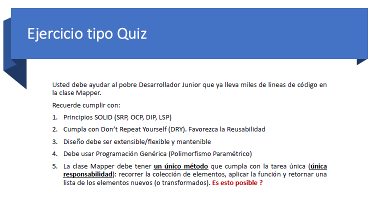

## Pregunta 4



```bash
# Se puede hacer no obstante la implementacion de la funcion en si no es OCP

class Mapper{
    constructor(){}
    cambiartodos<T,E>(elements:Component<T>[],f:(e:Component<T>)=>Component<E>):Component<E>[]{
        let components:Component<E>[]=[]
        elements.forEach(e=>{
            components.push(f(e))
        })
        return components
    }
}

#La implementacion de una funcion podria ser asi

interface stringDTO{
    data:string
}

function CambiarEstructuraComponentNumberToStringDTO(e:Component<number>):Component<stringDTO>{
    if(e instanceof Leaf) return new Leaf<stringDTO>({data:e.value.toString()})
    else
    if (e instanceof Composite){
        let composite= new Composite<stringDTO>({data:e.value.toString()})
        e.components.forEach(component => {
            composite.addelement(CambiarEstructuraComponentNumberToStringDTO(component))
        });        
        return composite
    }
    throw new Error('Elemento no encontrado por favor intentelo de nuevo')
}
#Es importante destacar que para proximas clases esta funcion no cumple OCP, pero el codigo del mapper del cambiar todos si es OCP
```

## Opcion 2 sin romper SOLID

Para hacerlo se utilizao el patron visitor, haciendo que los componentes tengan que implementar los elementos para ser visitados
De esta Forma si se cumpliria mejor con SOLID y nos evitariamos el uso del instance of, pero ya no usarios el mapper porque no cumple con liskof

```bash
class Mapper{
    constructor(){}
    cambiar<T,E>(element:T,f:(e:T)=>E):E{
        return f(element)
    }
}

# Al implementar f dentro del visitor 

interface IVisitor <T>{
    visitComponent(c:Composite<T>):void
    visitLeaf(l:Leaf<T>):void
}

class ComponentVisitorNumberString implements IVisitor <number>{
    visited:Component<number>[]=[]
    transformed:Component<string>[]=[]
    constructor(
        public mapper:Mapper
    ){}
    visitComponent(c: Composite<number>):void {
        this.visited.push(c)
        this.transformed.push(
            this.mapper.cambiar(c,this.transformComponentNumberToString)
        )
    }
    visitLeaf(l: Leaf<number>): void{
        this.visited.push(l)
        this.transformed.push(
            this.mapper.cambiar(l,this.transformLeafNumberToString)
        )
    }

    private transformComponentNumberToString(c:Composite<number>):Composite<string>{
        return new Composite(c.value.toString())
    }

    private transformLeafNumberToString(c:Leaf<number>):Leaf<string>{
        return new Leaf(c.value.toString())
    }
}

```


```bash
// Iteartor

interface IElementToVisit <T>{
    accept(v:IVisitor <T>):void
}

//Estructura composite
interface Component <T> extends IElementToVisit <T>{
    value:T
    recorrer():void
}


class Leaf <T> implements Component<T>{
    constructor(public value: T){}
    accept(v: IVisitor<T>): void {
        v.visitLeaf(this)
    }
    recorrer(): void {
        console.log(`soy una hoja mi valor es: ${JSON.stringify(this.value)}`);
    }
}

class Composite <T> implements Component<T>{
    components:Component<T>[]=[]

    constructor(public value: T){}
    accept(v: IVisitor<T>): void {
        v.visitComponent(this)
        this.components.forEach(vecino=>vecino.accept(v))
    }

    recorrer(): void {
        console.log("\x1b[33m%s\x1b[0m",`soy un componente mi valor es: ${JSON.stringify(this.value)}`);
        this.components.forEach(e=>{
            e.recorrer()    
        })
    }

    addelement(e:Component<T>){this.components.push(e)}
}
```