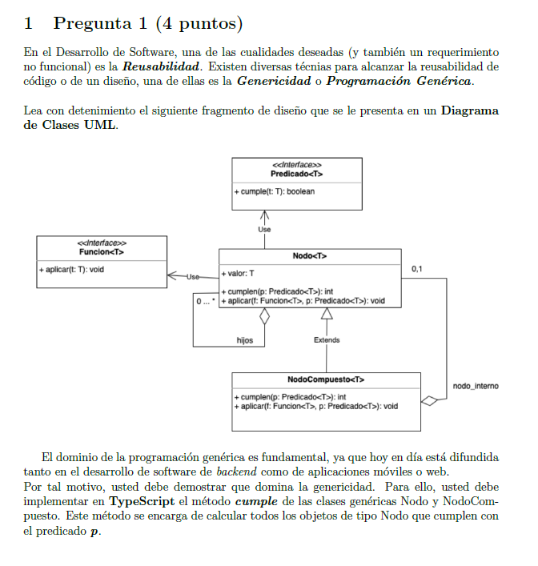

## Pregunta 1



### Respuesta
```bash
interface Predicado <T>{
    cumple(t:T):boolean
}

interface Funcion <T>{
    aplicar(t:T):void
}

class Nodo<T>{
    public hijos:Nodo<T>[]=[]
    constructor(
        public valor:T
    ) {}
    cumplen (p:Predicado<T>):number{
        let number=0
        if (p.cumple(this.valor)) number++
        this.hijos.forEach(hijo=>{
            if (p.cumple(hijo.valor)) number++
        })
        return number
    }
    aplicar(f:Funcion<T>,p:Predicado<T>):void{
        if (p.cumple(this.valor)) f.aplicar(this.valor)
        this.hijos.forEach(hijo=>{
            if (p.cumple(hijo.valor)) f.aplicar(hijo.valor)
    })
    }
}

class NodoCompuesto <T> extends Nodo <T>{
    //! NT No le puse optional por el enunciado del ejercicio
    private nodo_interno:Nodo<T>|null
    constructor(valor:T){
        super(valor)
    }
    cumplen (p:Predicado<T>):number{
        let valor=super.cumplen(p)
        if (this.nodo_interno) 
            if (p.cumple(this.nodo_interno.valor)) valor++
        return valor
    }
    aplicar(f:Funcion<T>,p:Predicado<T>):void{
        super.aplicar(f,p)
        if (this.nodo_interno) 
            if (p.cumple(this.nodo_interno.valor)) f.aplicar(this.nodo_interno.valor)
    }
}
```
