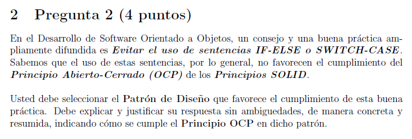

## Pregunta 2



### Respuesta
```bash
# Es el patron de diseño  "State" debido a que el patron
# state favorece evitar el uso de los if else condicionales
# o switches haciendo que varie por un contexto y estados concretos
# por ejemplo el uso de un juego donde el jugador necesite saber del juego por turnos para poder curarse o atacar de
# acuerdo a los estados que el jugador tiene en el juego
```
