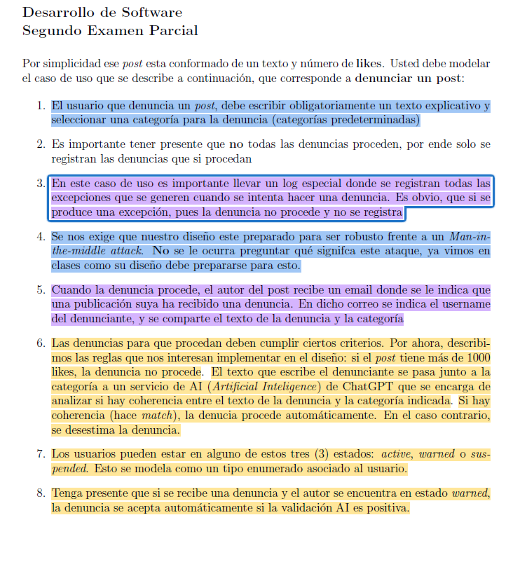

# Segundo-Examen-Parcial-31-05-2024-Ejercicio 3

<p align="center">
    
</p>

# Model

<p align="center">
    
</p>


## How To use it?

```bash
# Execute the following command
ts-node .\client.ts
```